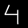

# neuralnetworkdemo
Neural Network Demo

 

## Purpose
This program shows how a neural network can be used to recognize hand-written digits. The network is being trained on the basis of the MNIST dataset. This work is based on the previous work of Michael Nielsen (see references at the bottom of this page).


## Compilation
```
mkdir build
cd build
cmake ../src
make -j9 && make test
```

## Usage

To train the network (using previously trained network)
```
./neuralnetworkdemo -t -i ../tests/image.ann -o ../tests/image.ann
```

To train the network from scratch
```
./neuralnetworkdemo -t -o ../tests/image.ann
```

To use the trained network to classify an image (i.e. recognize the hand-writing)
```
./neuralnetworkdemo -f ../tests/2.png -i ../tests/image.ann
```

## Image criteria
The image specifications for the .png file are:
* 28 x 28 px in grayscale with no alpha channel
* Black background with white foreground
* The digit needs to be sufficiently large for the algo to work

## References
1. This C++ program is based on "Neural Networks and Deep Learning" by Michael A. Nielsen. Please check out [his awesome website](http://neuralnetworksanddeeplearning.com/)!
2. The training set for the neural network is obtained from the [MNIST database](http://yann.lecun.com/exdb/mnist/). Y. LeCun, L. Bottou, Y. Bengio, and P. Haffner. "Gradient-based learning applied to document recognition." Proceedings of the IEEE, 86(11):2278-2324, November 1998.
